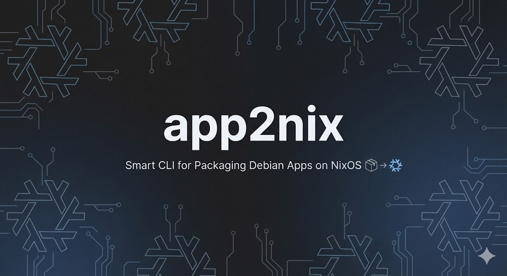

# app2nix

<p align="center">
  
</p>


[](https://www.rust-lang.org/)
[](https://nixos.org/)

**app2nix** is a smart CLI tool that automates the packaging of Debian (`.deb`) applications for Nix/NixOS.

Unlike simple converters that only read the `control` file, **app2nix** unpacks the package, scans binaries for ELF dependencies (using `patchelf`), and maps required shared libraries (`.so`) to their corresponding `nixpkgs` using `nix-locate`.

## 🚀 Features

* **🕵️ Binary Analysis**: Unpacks the `.deb` and scans executables to find *actual* runtime dependencies (e.g., `libdrm.so.2`, `libgbm.so.1`), preventing "library not found" errors.
* **🪄 Auto-Escalation**: Automatically checks for required tools (`patchelf`, `nix-locate`). If missing, it restarts itself inside a temporary `nix-shell`—no manual setup required!
* **🧠 Smart Resolution**: Uses a hybrid approach:
    * **Internal Map**: Instantly identifies common libraries (GTK, X11, GLib, Alsa) for speed.
    * **Nix-Index**: Queries the Nix file database for obscure or version-specific libraries.
* **⚡ Ready-to-Use Output**: Generates a `default.nix` that uses `autoPatchelfHook` and `makeWrapper` for immediate usage without writing boilerplate.

## 🛠 Prerequisites

For the "Binary Analysis" feature to work efficiently, `app2nix` relies on `nix-locate`. You need a file database for this.

**Option A: The Fast Way (Recommended)**
Download the pre-built database (takes ~5 seconds):
```bash
mkdir -p ~/.cache/nix-index && wget -O ~/.cache/nix-index/files https://github.com/Mic92/nix-index-database/releases/latest/download/index-x86_64-linux
```
**Option B: The Manual Way**
Generate the database locally (can take 10-15 minutes):

```bash
nix-shell -p nix-index --run "nix-index"
```
## 📦 Installation & Usage
### From Source
Clone and Build:

```bash
git clone https://github.com/yourusername/app2nix.git
cd app2nix
cargo build --release
```
Run:

```bash
# You can pass a URL or a local file path
./target/release/app2nix https://example.com/software.deb
```
Install/Test the Result:

```bash
nix-env -if default.nix
# or just build it
nix-build default.nix
```
## ⚠️ Known Limitations
**80/20 Rule**: This tool aims to automate 80-90% of the work. Complex applications (especially Electron or Qt apps with hardcoded paths) might still require manual tweaking of the generated `default.nix`.

**Database Requirement**: If `nix-locate` returns nothing, the tool will warn you about missing dependencies. Ensure your `nix-index` database is populated (see Prerequisites).

## 🗺️ Roadmap
- [ ] Optimize `default.nix` generation template.
- [ ] Add support for creating Pull Requests to `nixpkgs` automatically.
- [ ] Improve heuristics for "dirty" packages (Electron, Qt, proprietary blobs).
- [ ] Add support for RPM (`.rpm`) packages.