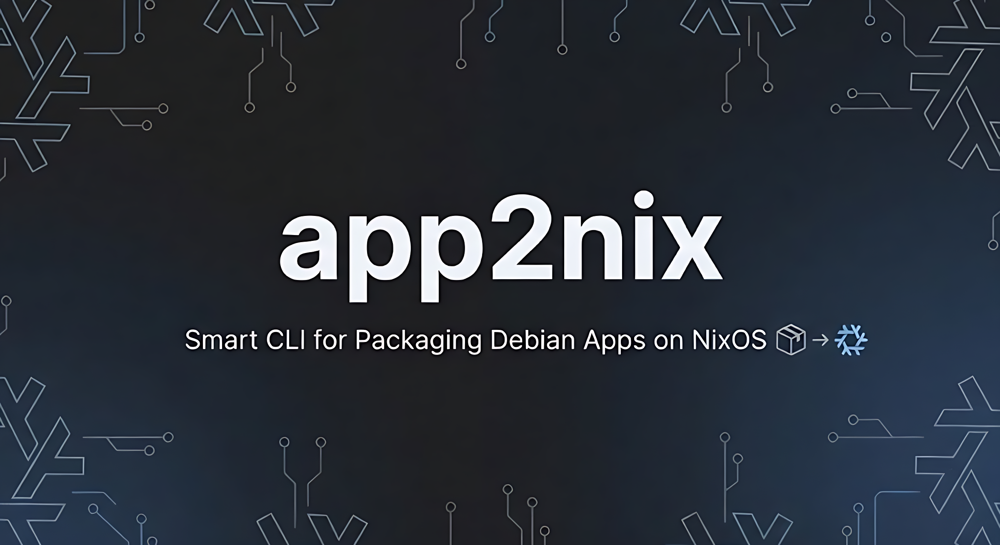

# app2nix
<p align="center">
    
</p>

[](https://www.rust-lang.org/)
[](https://nixos.org/)

**app2nix** is a smart CLI tool that automates the packaging of Debian (`.deb`) applications for Nix/NixOS.

Unlike simple converters that only read the `control` file, **app2nix** unpacks the package, scans binaries for ELF dependencies (using `patchelf`), and maps required shared libraries (`.so`) to their Nixpkgs counterparts.

## 🚀 Features

*   **🕵️ Binary Analysis**: Unpacks the `.deb` and scans executables to find *actual* runtime dependencies (e.g., `libdrm.so.2`, `libgbm.so.1`), preventing "library not found" errors.
*   **🪄 Auto-Escalation**: Automatically checks for required tools (`patchelf`, `nix-locate`). If missing, it uses Nix to provide them—no manual setup required!
*   **🧠 Smart Resolution**: Uses a hybrid approach:
    *   **Internal Map**: Instantly identifies common libraries (GTK, X11, GLib, Alsa) for speed.
    *   **Nix-Index**: Queries the Nix file database for obscure or version-specific libraries.
*   **⚡ Ready-to-Use Output**: Generates a `default.nix` that uses `autoPatchelfHook` and `makeWrapper` for immediate usage without writing boilerplate.

## 📦 Usage (Flakes)

You don't need to clone the repository or compile anything manually. You can run `app2nix` directly using Nix Flakes.

### Run directly (Recommended)
Pass the URL or local path to your `.deb` file after the `--` separator:

```bash
nix run github:Er1ckR1ck0/app2nix -- https://example.com/software.deb
```

### Install to profile
If you plan to use it frequently, add it to your profile:

```bash
nix profile install github:Er1ckR1ck0/app2nix
```

### Build the Result
Once `app2nix` generates the `default.nix` file in your current directory:

```bash
# Build and install into user environment
nix-env -if default.nix

# Or just build the derivation
nix-build default.nix
```

## ⚠️ Known Limitations
**80/20 Rule**: This tool aims to automate 80-90% of the work. Complex applications (especially Electron or Qt apps with hardcoded paths) might still require manual tweaking of the generated `default.nix`.

## 🗺️ Roadmap

- [x] **Flake Support**: Simplify usage with `nix run`.
- [x] **Optimize `default.nix` template**: Ensure output uses modern hooks like `autoPatchelfHook`.
- [ ] **Automate PR creation**: Add support for creating Pull Requests to `nixpkgs` automatically.
- [ ] **Advanced Heuristics**: Improve detection for "dirty" packages (Electron, Qt, proprietary blobs).
- [ ] **RPM Support**: Add support for `.rpm` packages.
